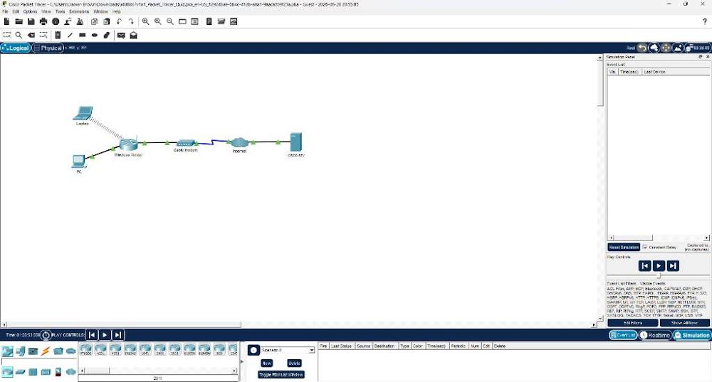
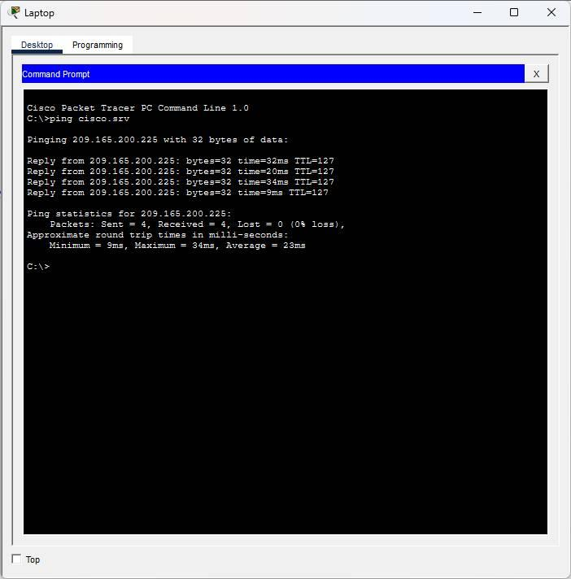
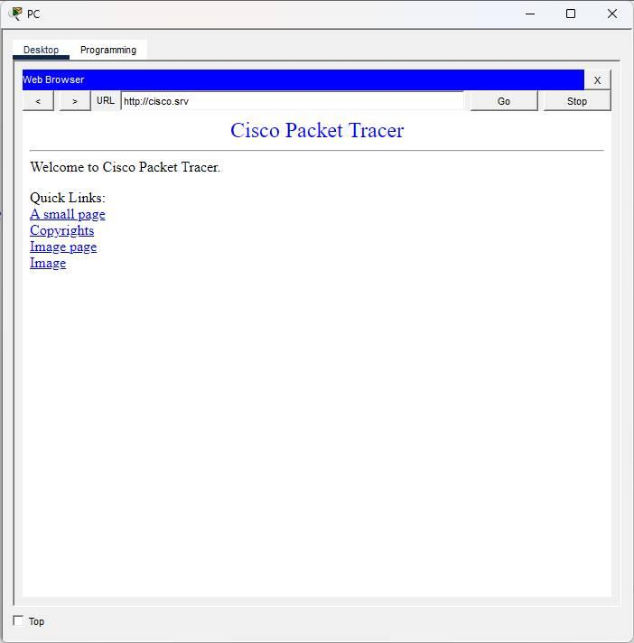

# Darwin-SOHO-Network-Infrastructure-Lab
Hands-on Cisco Packet Tracer lab demonstrating SOHO network configuration, DHCP address allocation, WPA2 wireless client deployment, and end-to-end network verification.

---

## 🗺️ Network Topology Map

*Figure 1: Logical network design featuring local client devices routing over a simulated cable broadband internet connection to a corporate datacenter server.*

---

## 📊 IP Addressing Table

| Device | Interface | IP Address | Subnet Mask | Default Gateway | Purpose |
| :--- | :--- | :--- | :--- | :--- | :--- |
| **PC** | FastEthernet0 | DHCP Assigned | 255.255.255.0 | 172.16.0.254 | Home Workspace Client |
| **Laptop** | Wireless0 | DHCP Assigned | 255.255.255.0 | 172.16.0.254 | Remote Employee Laptop |
| **Wireless Router** | LAN / Wi-Fi | 172.16.0.254 | 255.255.255.0 | N/A | SOHO Local Gateway |
| **Wireless Router** | Internet (WAN)| DHCP Assigned | Variable | ISP Gateway | Edge NAT Gateway |
| **cisco.srv** | NIC | 209.165.200.225| 255.255.255.0 | 209.165.200.1 | Remote Corporate Cloud Server |

---

## 🛠️ Implementation & Technical Objectives

* **Dynamic Client Addressing**: Verified local network client configuration using **DHCP automation**, successfully obtaining gateway profiles and DNS details from the local SOHO wireless access point.
* **Network Address Translation (NAT)**: Confirmed address translation mechanics at the router boundary, allowing private LAN workspace devices to route across public broadband spaces securely.
* **Domain Name Services (DNS)**: Demonstrated operational application layer resolution by targeting resource locations via domain hostname pointers rather than raw IP addressing.

---

## 🔍 Verification & Proof of Connectivity

### 1. End-to-End Ping Test

*Figure 2: ICMP verification from the local client terminal to the remote corporate server showing 0% packet loss.*

### 2. Web Server Access Verification

*Figure 3: Verification showing successful connection to the cisco.srv website homepage from the local client web browser tool.*
